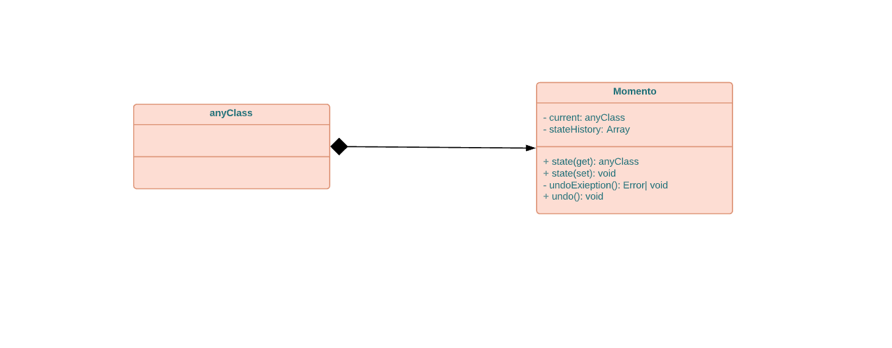

# This is notes for head first design patterens and some other design patterns

## Design Principles

1- Identify the aspects of your application that vary and separate them from what stays the same

## Design Patterens

### This is a list of all design patterns

* [Momento](#momento)

### momento

this is a way to save and restore the state of an object



```js
class Momento {
	constructor(state) {
		this.current = state;
		this.statHistory = new Array('');
	}
	get state() {
		return this.current;
	}
	set state(state) {
		this.statHistory.push(this.current);
		this.current = state;
	}
	undoExeption(){
		if(this.statHistory.length == 0){
			throw new Error('There is no moe state to undo');
		}
		else 
			this.current = this.statHistory.pop();
	}
	undo() {
		try{
			this.undoExeption();
		}
		catch(e){
			console.error(e.message);
		}
	}
}

```

