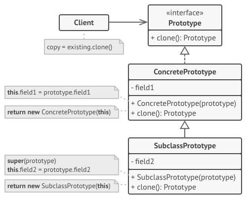

# Creational Patterns

---

Now we will go deep in some creational patterns and there UML to them

## Table of Content

## Factory Design Pattern

### What is Factory Design Pattern?

This used if You don't Know excatly how you gonna work with and make your code more expandable for next updates

### Factory Design Pattern UML


### Notes on Factory DP

#### When to use factory design Pattern

1. Use the Factory Method when you don’t know beforehand the exact types and dependencies of the objects your code should work with.

1. Use the Factory Method when you want to provide users of your library or framework with a way to extend its internal components.

1. Use the Factory Method when you want to save system resources by reusing existing objects instead of rebuilding them each time.

#### How To implement

1. Make all products follow the same interface. This interface should declare methods that make sense in every product.

1. Add an empty factory method inside the creator class. The return type of the method should match the common product interface.

1. In the creator’s code find all references to product constructors. One by one, replace them with calls to the factory method, while extracting the product creation code into the factory method.

1. You might need to add a temporary parameter to the factory method to control the type of returned product.

1. At this point, the code of the factory method may look pretty ugly. It may have a large switch operator that picks which product class to instantiate. But don’t worry, we’ll fix it soon enough.

1. Now, create a set of creator subclasses for each type of product listed in the factory method. Override the factory method in the subclasses and extract the appropriate bits of construction code from the base method.

1. If there are too many product types and it doesn’t make sense to create subclasses for all of them, you can reuse the control parameter from the base class in subclasses.

1. For instance, imagine that you have the following hierarchy of classes: the base Mail class with a couple of subclasses: AirMail and GroundMail; the Transport classes are Plane, Truck and Train. While the AirMail class only uses Plane objects, GroundMail may work with both Truck and Train objects. You can create a new subclass (say TrainMail) to handle both cases, but there’s another option. The client code can pass an argument to the factory method of the GroundMail class to control which product it wants to receive.

1. If, after all of the extractions, the base factory method has become empty, you can make it abstract. If there’s something left, you can make it a default behavior of the method.

#### Code samplte in __TypeScript__

```ts
/**
 * The Creator class declares the factory method that is supposed to return an
 * object of a Product class. The Creator's subclasses usually provide the
 * implementation of this method.
 */
abstract class Creator {
 /**
  * Note that the Creator may also provide some default implementation of the
  * factory method.
  */
 public abstract factoryMethod(): Product;

 /**
  * Also note that, despite its name, the Creator's primary responsibility is
  * not creating products. Usually, it contains some core business logic that
  * relies on Product objects, returned by the factory method. Subclasses can
  * indirectly change that business logic by overriding the factory method
  * and returning a different type of product from it.
  */
 public someOperation(): string {
  // Call the factory method to create a Product object.
  const product = this.factoryMethod();
  // Now, use the product.
  return `Creator: The same creator's code has just worked with ${product.operation()}`;
 }
}

/**
 * Concrete Creators override the factory method in order to change the
 * resulting product's type.
 */
class ConcreteCreator1 extends Creator {
 /**
  * Note that the signature of the method still uses the abstract product
  * type, even though the concrete product is actually returned from the
  * method. This way the Creator can stay independent of concrete product
  * classes.
  */
 public factoryMethod(): Product {
  return new ConcreteProduct1();
 }
}

class ConcreteCreator2 extends Creator {
 public factoryMethod(): Product {
  return new ConcreteProduct2();
 }
}

/**
 * The Product interface declares the operations that all concrete products must
 * implement.
 */
interface Product {
 operation(): string;
}

/**
 * Concrete Products provide various implementations of the Product interface.
 */
class ConcreteProduct1 implements Product {
 public operation(): string {
  return '{Result of the ConcreteProduct1}';
 }
}

class ConcreteProduct2 implements Product {
 public operation(): string {
  return '{Result of the ConcreteProduct2}';
 }
}

/**
 * The client code works with an instance of a concrete creator, albeit through
 * its base interface. As long as the client keeps working with the creator via
 * the base interface, you can pass it any creator's subclass.
 */
function clientCode(creator: Creator) {
 // ...
 console.log('Client: I\'m not aware of the creator\'s class, but it still works.');
 console.log(creator.someOperation());
 // ...
}

/**
 * The Application picks a creator's type depending on the configuration or
 * environment.
 */
console.log('App: Launched with the ConcreteCreator1.');
clientCode(new ConcreteCreator1());
console.log('');

console.log('App: Launched with the ConcreteCreator2.');
clientCode(new ConcreteCreator2());
```

## Abstract Factory Design Pattern

### What is Abstract Factory Design Pattern?

If I had some stuff that is siamilar in some stuff like if we had a chair and sofa and other stuff but they all share the same style and colors we can use this design pattern to make it easier to change the style.

### abstract factory UML


### Notes on Abstract Factory Design Pattern

#### When to use abstract factory design Pattern

Use the Abstract Factory when your code needs to work with various families of related products, but you don’t want it to depend on the concrete classes of those products—they might be unknown beforehand or you simply want to allow for future extensibility.

#### How to implement

1. Map out a matrix of distinct product types versus variants of these products.

1. Declare abstract product interfaces for all product types. Then make all concrete product classes implement these interfaces.

1. Declare the abstract factory interface with a set of creation methods for all abstract products.

1. Implement a set of concrete factory classes, one for each product variant.

1. Create factory initialization code somewhere in the app. It should instantiate one of the concrete factory classes, depending on the application configuration or the current environment. Pass this factory object to all classes that construct products.

1. Scan through the code and find all direct calls to product constructors. Replace them with calls to the appropriate creation method on the factory object.

#### Code sample

```ts
/**
 * The Abstract Factory interface declares a set of methods that return
 * different abstract products. These products are called a family and are
 * related by a high-level theme or concept. Products of one family are usually
 * able to collaborate among themselves. A family of products may have several
 * variants, but the products of one variant are incompatible with products of
 * another.
 */
interface AbstractFactory {
    createProductA(): AbstractProductA;

    createProductB(): AbstractProductB;
}

/**
 * Concrete Factories produce a family of products that belong to a single
 * variant. The factory guarantees that resulting products are compatible. Note
 * that signatures of the Concrete Factory's methods return an abstract product,
 * while inside the method a concrete product is instantiated.
 */
class ConcreteFactory1 implements AbstractFactory {
    public createProductA(): AbstractProductA {
        return new ConcreteProductA1();
    }

    public createProductB(): AbstractProductB {
        return new ConcreteProductB1();
    }
}

/**
 * Each Concrete Factory has a corresponding product variant.
 */
class ConcreteFactory2 implements AbstractFactory {
    public createProductA(): AbstractProductA {
        return new ConcreteProductA2();
    }

    public createProductB(): AbstractProductB {
        return new ConcreteProductB2();
    }
}

/**
 * Each distinct product of a product family should have a base interface. All
 * variants of the product must implement this interface.
 */
interface AbstractProductA {
    usefulFunctionA(): string;
}

/**
 * These Concrete Products are created by corresponding Concrete Factories.
 */
class ConcreteProductA1 implements AbstractProductA {
    public usefulFunctionA(): string {
        return 'The result of the product A1.';
    }
}

class ConcreteProductA2 implements AbstractProductA {
    public usefulFunctionA(): string {
        return 'The result of the product A2.';
    }
}

/**
 * Here's the the base interface of another product. All products can interact
 * with each other, but proper interaction is possible only between products of
 * the same concrete variant.
 */
interface AbstractProductB {
    /**
     * Product B is able to do its own thing...
     */
    usefulFunctionB(): string;

    /**
     * ...but it also can collaborate with the ProductA.
     *
     * The Abstract Factory makes sure that all products it creates are of the
     * same variant and thus, compatible.
     */
    anotherUsefulFunctionB(collaborator: AbstractProductA): string;
}

/**
 * These Concrete Products are created by corresponding Concrete Factories.
 */
class ConcreteProductB1 implements AbstractProductB {

    public usefulFunctionB(): string {
        return 'The result of the product B1.';
    }

    /**
     * The variant, Product B1, is only able to work correctly with the variant,
     * Product A1. Nevertheless, it accepts any instance of AbstractProductA as
     * an argument.
     */
    public anotherUsefulFunctionB(collaborator: AbstractProductA): string {
        const result = collaborator.usefulFunctionA();
        return `The result of the B1 collaborating with the (${result})`;
    }
}

class ConcreteProductB2 implements AbstractProductB {

    public usefulFunctionB(): string {
        return 'The result of the product B2.';
    }

    /**
     * The variant, Product B2, is only able to work correctly with the variant,
     * Product A2. Nevertheless, it accepts any instance of AbstractProductA as
     * an argument.
     */
    public anotherUsefulFunctionB(collaborator: AbstractProductA): string {
        const result = collaborator.usefulFunctionA();
        return `The result of the B2 collaborating with the (${result})`;
    }
}

/**
 * The client code works with factories and products only through abstract
 * types: AbstractFactory and AbstractProduct. This lets you pass any factory or
 * product subclass to the client code without breaking it.
 */
function clientCode(factory: AbstractFactory) {
    const productA = factory.createProductA();
    const productB = factory.createProductB();

    console.log(productB.usefulFunctionB());
    console.log(productB.anotherUsefulFunctionB(productA));
}

/**
 * The client code can work with any concrete factory class.
 */
console.log('Client: Testing client code with the first factory type...');
clientCode(new ConcreteFactory1());

console.log('');

console.log('Client: Testing the same client code with the second factory type...');
clientCode(new ConcreteFactory2());
```

## Builder Design Pattern

### What is it?

The Builder Design Pattern is used to create complex objects with constituent parts that must be created in the same order or using a specific algorithm.  
for Example think of a car and I want to build a complex car that has a body, engine, and wheels.  
and they may really differ from car to another so you can make builder class that you make and build the car as you which then it will return the wanted car to you.  
**director class** is the class that is responsible for creating the complex object using the builder class.

### Builder Design Pattern UML


### When to use this design pattern?

- Use the Builder pattern to get rid of a “telescopic constructor”.

- Use the Builder pattern when you want your code to be able to create different representations of some product (for example, stone and wooden houses).

- Use the Builder to construct Composite trees or other complex objects.

### How to implement this design pattern?

1. Make sure that you can clearly define the common construction steps for building all available product representations. Otherwise, you won’t be able to proceed with implementing the pattern.

1. Declare these steps in the base builder interface.

1. Create a concrete builder class for each of the product representations and implement their construction steps.

1. Don’t forget about implementing a method for fetching the result of the construction. The reason why this method can’t be declared inside the builder interface is that various builders may construct products that don’t have a common interface. Therefore, you don’t know what would be the return type for such a method. However, if you’re dealing with products from a single hierarchy, the fetching method can be safely added to the base interface.

1. Think about creating a director class. It may encapsulate various ways to construct a product using the same builder object.

1. The client code creates both the builder and the director objects. Before construction starts, the client must pass a builder object to the director. Usually, the client does this only once, via parameters of the director’s constructor. The director uses the builder object in all further construction. There’s an alternative approach, where the builder is passed directly to the construction method of the director.

1. The construction result can be obtained directly from the director only if all products follow the same interface. Otherwise, the client should fetch the result from the builder.

### Notes

- Many designs start by using Factory Method (less complicated and more customizable via subclasses) and evolve toward Abstract Factory, Prototype, or Builder (more flexible, but more complicated).

- Builder focuses on constructing complex objects step by step. Abstract Factory specializes in creating families of related objects. Abstract Factory returns the product immediately, whereas Builder lets you run some additional construction steps before fetching the product.

- You can use Builder when creating complex Composite trees because you can program its construction steps to work recursively.

- You can combine Builder with Bridge: the director class plays the role of the abstraction, while different builders act as implementations.

- Abstract Factories, Builders and Prototypes can all be implemented as Singletons.

### Code Sample

```ts
/**
 * The Builder interface specifies methods for creating the different parts of
 * the Product objects.
 */
interface Builder {
    producePartA(): void;
    producePartB(): void;
    producePartC(): void;
}

/**
 * The Concrete Builder classes follow the Builder interface and provide
 * specific implementations of the building steps. Your program may have several
 * variations of Builders, implemented differently.
 */
class ConcreteBuilder1 implements Builder {
    private product: Product1;

    /**
     * A fresh builder instance should contain a blank product object, which is
     * used in further assembly.
     */
    constructor() {
        this.reset();
    }

    public reset(): void {
        this.product = new Product1();
    }

    /**
     * All production steps work with the same product instance.
     */
    public producePartA(): void {
        this.product.parts.push('PartA1');
    }

    public producePartB(): void {
        this.product.parts.push('PartB1');
    }

    public producePartC(): void {
        this.product.parts.push('PartC1');
    }

    /**
     * Concrete Builders are supposed to provide their own methods for
     * retrieving results. That's because various types of builders may create
     * entirely different products that don't follow the same interface.
     * Therefore, such methods cannot be declared in the base Builder interface
     * (at least in a statically typed programming language).
     *
     * Usually, after returning the end result to the client, a builder instance
     * is expected to be ready to start producing another product. That's why
     * it's a usual practice to call the reset method at the end of the
     * `getProduct` method body. However, this behavior is not mandatory, and
     * you can make your builders wait for an explicit reset call from the
     * client code before disposing of the previous result.
     */
    public getProduct(): Product1 {
        const result = this.product;
        this.reset();
        return result;
    }
}

/**
 * It makes sense to use the Builder pattern only when your products are quite
 * complex and require extensive configuration.
 *
 * Unlike in other creational patterns, different concrete builders can produce
 * unrelated products. In other words, results of various builders may not
 * always follow the same interface.
 */
class Product1 {
    public parts: string[] = [];

    public listParts(): void {
        console.log(`Product parts: ${this.parts.join(', ')}\n`);
    }
}

/**
 * The Director is only responsible for executing the building steps in a
 * particular sequence. It is helpful when producing products according to a
 * specific order or configuration. Strictly speaking, the Director class is
 * optional, since the client can control builders directly.
 */
class Director {
    private builder: Builder;

    /**
     * The Director works with any builder instance that the client code passes
     * to it. This way, the client code may alter the final type of the newly
     * assembled product.
     */
    public setBuilder(builder: Builder): void {
        this.builder = builder;
    }

    /**
     * The Director can construct several product variations using the same
     * building steps.
     */
    public buildMinimalViableProduct(): void {
        this.builder.producePartA();
    }

    public buildFullFeaturedProduct(): void {
        this.builder.producePartA();
        this.builder.producePartB();
        this.builder.producePartC();
    }
}

/**
 * The client code creates a builder object, passes it to the director and then
 * initiates the construction process. The end result is retrieved from the
 * builder object.
 */
function clientCode(director: Director) {
    const builder = new ConcreteBuilder1();
    director.setBuilder(builder);

    console.log('Standard basic product:');
    director.buildMinimalViableProduct();
    builder.getProduct().listParts();

    console.log('Standard full featured product:');
    director.buildFullFeaturedProduct();
    builder.getProduct().listParts();

    // Remember, the Builder pattern can be used without a Director class.
    console.log('Custom product:');
    builder.producePartA();
    builder.producePartC();
    builder.getProduct().listParts();
}

const director = new Director();
clientCode(director);
```

## Prototype Design Pattern

### What is prototype?

Prototype is a creational design pattern that lets you copy existing objects without making your code dependent on their classes.

### Protype design pattern UML



### How to implempent prototype design pattern?

1. Create the prototype interface and declare the clone method in it. Or just add the method to all classes of an existing class hierarchy, if you have one.

1. A prototype class must define the alternative constructor that accepts an object of that class as an argument. The constructor must copy the values of all fields defined in the class from the passed object into the newly created instance. If you’re changing a subclass, you must call the parent constructor to let the superclass handle the cloning of its private fields.

1. If your programming language doesn’t support method overloading, you may define a special method for copying the object data. The constructor is a more convenient place to do this because it delivers the resulting object right after you call the new operator.

1. The cloning method usually consists of just one line: running a new operator with the prototypical version of the constructor. Note, that every class must explicitly override the cloning method and use its own class name along with the new operator. Otherwise, the cloning method may produce an object of a parent class.

1. Optionally, create a centralized prototype registry to store a catalog of frequently used prototypes.

1. You can implement the registry as a new factory class or put it in the base prototype class with a static method for fetching the prototype. This method should search for a prototype based on search criteria that the client code passes to the method. The criteria might either be a simple string tag or a complex set of search parameters. After the appropriate prototype is found, the registry should clone it and return the copy to the client.

1. Finally, replace the direct calls to the subclasses’ constructors with calls to the factory method of the prototype registry.

### code sample

```ts
/**
 * The example class that has cloning ability. We'll see how the values of field
 * with different types will be cloned.
 */
class Prototype {
    public primitive: any;
    public component: object;
    public circularReference: ComponentWithBackReference;

    public clone(): this {
        const clone = Object.create(this);

        clone.component = Object.create(this.component);

        // Cloning an object that has a nested object with backreference
        // requires special treatment. After the cloning is completed, the
        // nested object should point to the cloned object, instead of the
        // original object. Spread operator can be handy for this case.
        clone.circularReference = {
            ...this.circularReference,
            prototype: { ...this },
        };

        return clone;
    }
}

class ComponentWithBackReference {
    public prototype;

    constructor(prototype: Prototype) {
        this.prototype = prototype;
    }
}

/**
 * The client code.
 */
function clientCode() {
    const p1 = new Prototype();
    p1.primitive = 245;
    p1.component = new Date();
    p1.circularReference = new ComponentWithBackReference(p1);

    const p2 = p1.clone();
    if (p1.primitive === p2.primitive) {
        console.log('Primitive field values have been carried over to a clone. Yay!');
    } else {
        console.log('Primitive field values have not been copied. Booo!');
    }
    if (p1.component === p2.component) {
        console.log('Simple component has not been cloned. Booo!');
    } else {
        console.log('Simple component has been cloned. Yay!');
    }

    if (p1.circularReference === p2.circularReference) {
        console.log('Component with back reference has not been cloned. Booo!');
    } else {
        console.log('Component with back reference has been cloned. Yay!');
    }

    if (p1.circularReference.prototype === p2.circularReference.prototype) {
        console.log('Component with back reference is linked to original object. Booo!');
    } else {
        console.log('Component with back reference is linked to the clone. Yay!');
    }
}

clientCode();
```

## Singleton Design Pattern

### What is singleton?

it's a design pattern that is used to ensure that only one instance of a class is created.  
for Example:

If I want to make a class that works with a database, I can use singleton pattern, because I want to make sure that only one connection is open at a time.

### singleton design pattern UML


### How to implement singleton design pattern?

1. Add a private static field to the class for storing the singleton instance.

1. Declare a public static creation method for getting the singleton instance.

1. Implement “lazy initialization” inside the static method. It should create a new object on its first call and put it into the static field. The method should always return that instance on all subsequent calls.

1. Make the constructor of the class private. The static method of the class will still be able to call the constructor, but not the other objects.

1. Go over the client code and replace all direct calls to the singleton’s constructor with calls to its static creation method.

### Code Sample for singleton design pattern

```ts
/**
 * The Singleton class defines the `getInstance` method that lets clients access
 * the unique singleton instance.
 */
class Singleton {
    private static instance: Singleton;

    /**
     * The Singleton's constructor should always be private to prevent direct
     * construction calls with the `new` operator.
     */
    private constructor() { }

    /**
     * The static method that controls the access to the singleton instance.
     *
     * This implementation let you subclass the Singleton class while keeping
     * just one instance of each subclass around.
     */
    public static getInstance(): Singleton {
        if (!Singleton.instance) {
            Singleton.instance = new Singleton();
        }

        return Singleton.instance;
    }

    /**
     * Finally, any singleton should define some business logic, which can be
     * executed on its instance.
     */
    public someBusinessLogic() {
        // ...
    }
}

/**
 * The client code.
 */
function clientCode() {
    const s1 = Singleton.getInstance();
    const s2 = Singleton.getInstance();

    if (s1 === s2) {
        console.log('Singleton works, both variables contain the same instance.');
    } else {
        console.log('Singleton failed, variables contain different instances.');
    }
}

clientCode();
```
